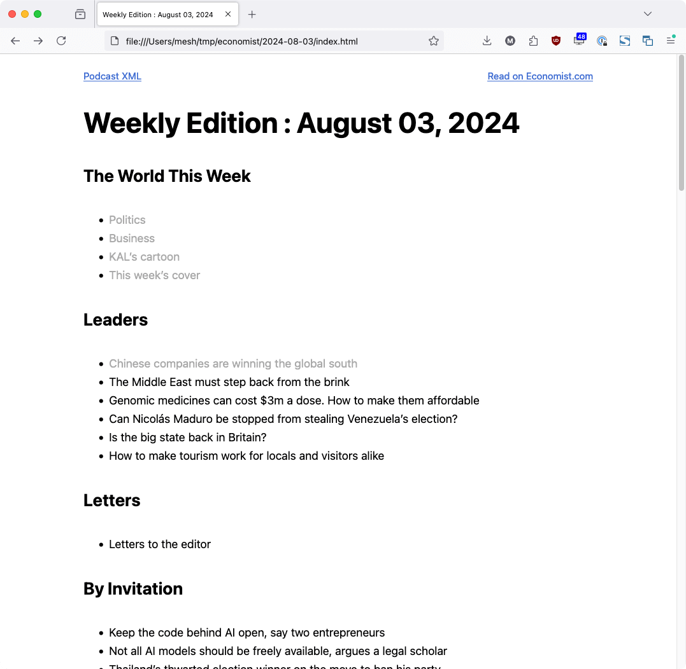
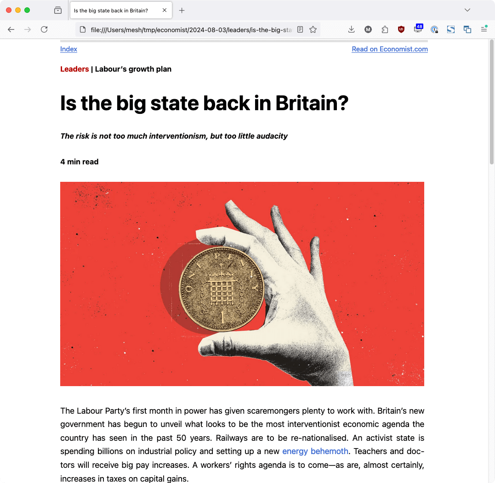
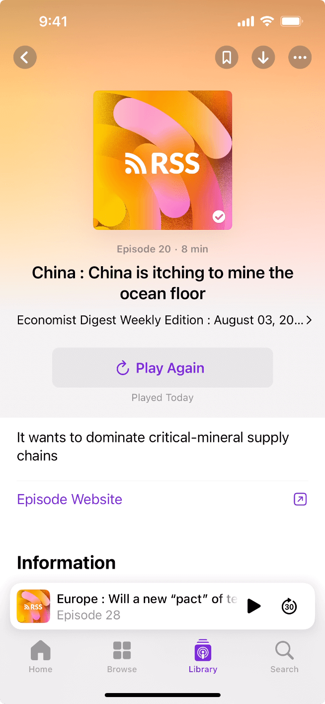

# Digest

Digest is a Python3 script that creates a local version of the weekly Economist magazine that aims to provide an improved reading and listening experience.

Specifically, it:

* Creates a local archive of the weekly magazine / edition
* Provides a optimized reading experience
* Support for core article content, images and audio
* Easily navigate between sections and articles
* Ability to read offline
* Reading is HTML based, so you can choose your reading client
* Quickly jump to source articles on The Economist website
* Generates an RSS feed for audio content that can be used to listen to weekly edition as a podcast in your favorite podcast client
* Ability to sync and listen to the audio podcast offline
* Support for article summaries via LLMs and Ollama


The project was built to work around performance issues and limitation of the Economist website and mobile application. 

This project requires that you have access to the digital version of the Economist, and is not affiliated with or supported by The Economist.


## Images

### Desktop Browser
  

### Mobile Browser


### Mobile Podcast

  

### File Layout


## Installation

The script requires Python3 and a number of libraries to be installed. You can install the required libraries with:

```bash
pip install -r requirements.txt
```

## Usage

Before running the script, you must log into economist.com with an account that has access to the weekly edition, using one of the following browsers:

* Firefox (firefox)
* Google Chrome (chrome)
* Microsoft Edge (edge)
* Opera (opera)

and make sure to pass to the script like so:

```bash
python3 digest.py --output-dir ~/tmp/economist/ --cookie-source chrome
```

This is necessary to set the cookies for the script that will authenticate your account.

This will generate a folder in the form of **YYYY-MM-DD** in the specified output directory. The folder will contain an *index.html* file which can be loaded into a browser to access all of the content.

You can find a complete list of options by running:

```bash
python3 digest.py --help
```
## Generating Article Summaries using LLMs

The script includes support for generating article summaries using large language models accessible via the Ollama API. The summaries are appended to the bottom of the articles.

It has been tested with the following LLMs:
* [Meta llama 3.1](https://llama.meta.com/)

In order to use the feature you must either install [Ollama](https://ollama.com/) locally, and pull an LLM, or have a URL where the Ollama API can be accessed. By default, the script assumes a local installation on the default port (11434).

To enable summaries, just pass the **--create-summary** flag:

```bash
python3 digest.py --output-dir ~/tmp/economist/ --create-summary
```

This will create summaries using a local Ollama API url, with the **llama3.1** model.

You can specify a specific model via the **llm** argument:

```bash
python3 digest.py --output-dir ~/tmp/economist/ --create-summary --llm "llama3.1:70b"
```

Note, depending on the hardware configuration where Ollama runs, summary generation may take an extended amount of time, particularly with larger parameter models (such as llama 3.1 70b and 450b).

Finally, if you want to use a remote Ollama server, you can specify the base URL for that via the **ollama-base-url** argument:

```bash
python3 digest.py --output-dir ~/tmp/economist/ --create-summary --ollama-base-url "https://mydomain.com:11434"
```

## Using the Generated Podcast feed

An XML file will be generated that creates a podcast from the mp3 files for the current weekly edition. It is generated in serial mode with the order of the episodes based on the order of the articles online.

This file can be used to create a podcast to listen through the weekly edition, as well as sync all of the files offline to listen when you don't have network coverage.

Each podcast / URL represents a single weekly edition, and you will need to generate and add a new url for new editions.

You can find info on how to add the URL to Apple podcast [here](https://podcasters.apple.com/support/828-test-your-podcast)

Note that the mp3 files are not downloaded by the script, but rather they are linked to their online location.

Also, in order to add the URL to your podcasting app, you may need to host it online when you add it.

## Known Issues

* There's no support for Brave browser yet.
* Release v0.85.2 does not generated entire digest

## Questions, Feature Requests, Feedback

If you have any questions, feature requests, need help, or just want to chat, you can ping me on [Twitter](https://twitter.com/mesh) or via email at [mikechambers@gmail.com](mailto:mikechambers@gmail.com).

You can also log bugs and feature requests on the [issues page](https://github.com/mikechambers/digest/issues).

## License

Project released under a [MIT License](LICENSE.md).

[](LICENSE.md)
